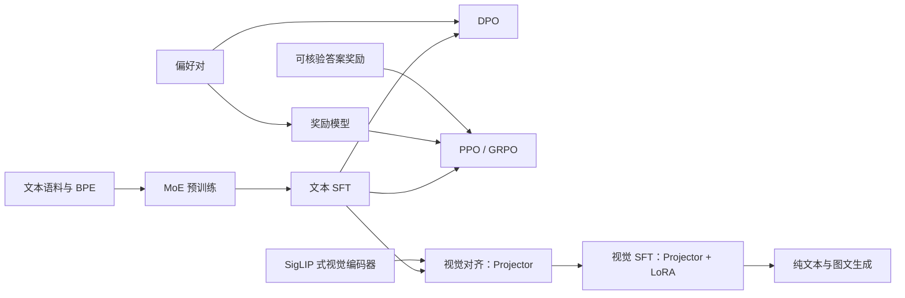
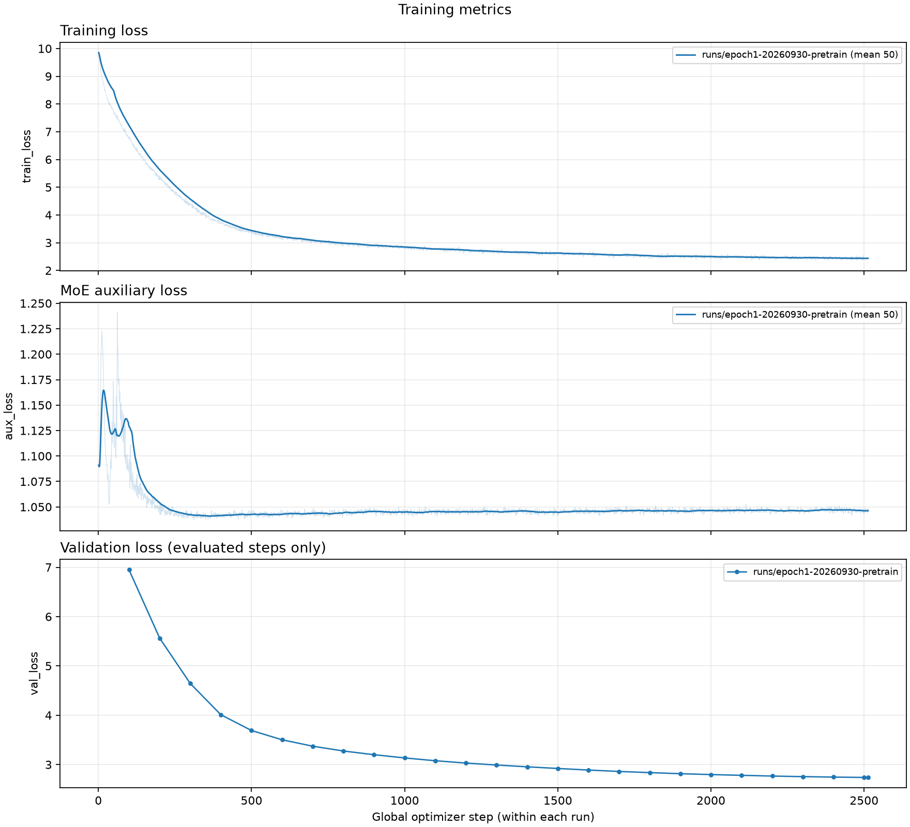
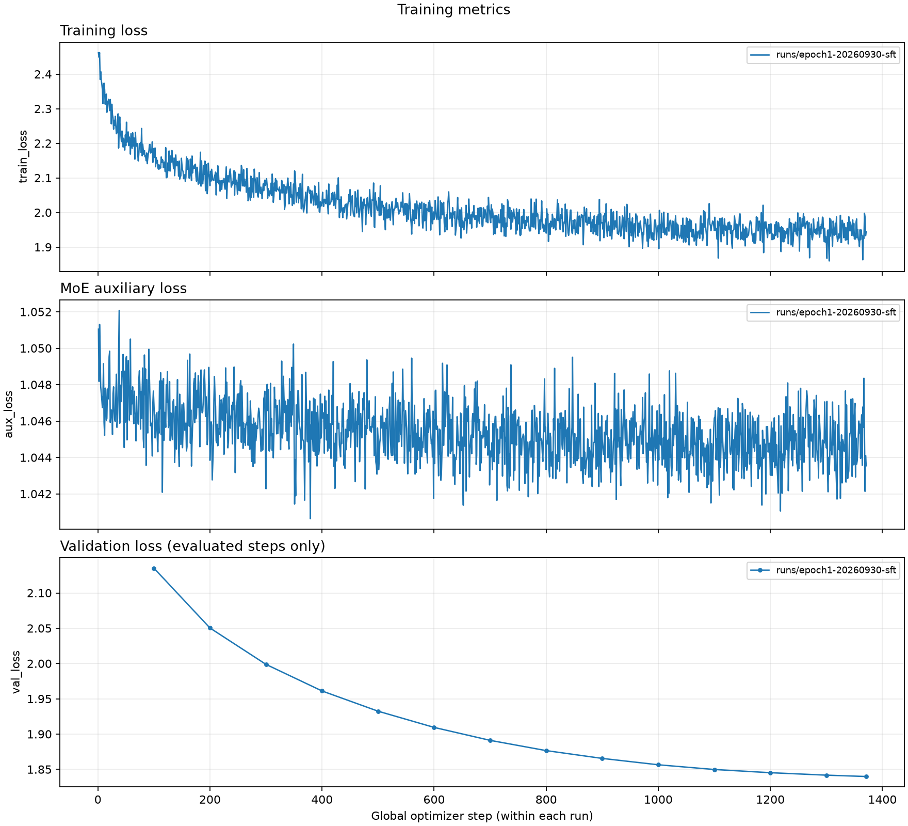
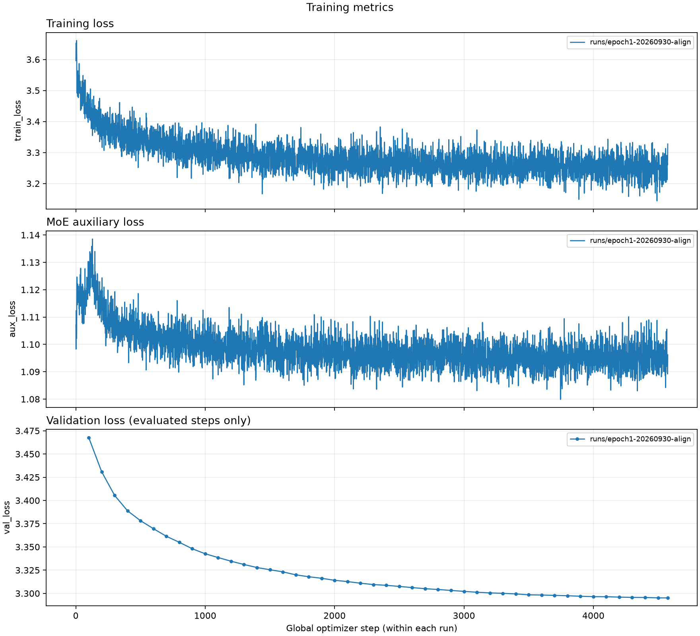
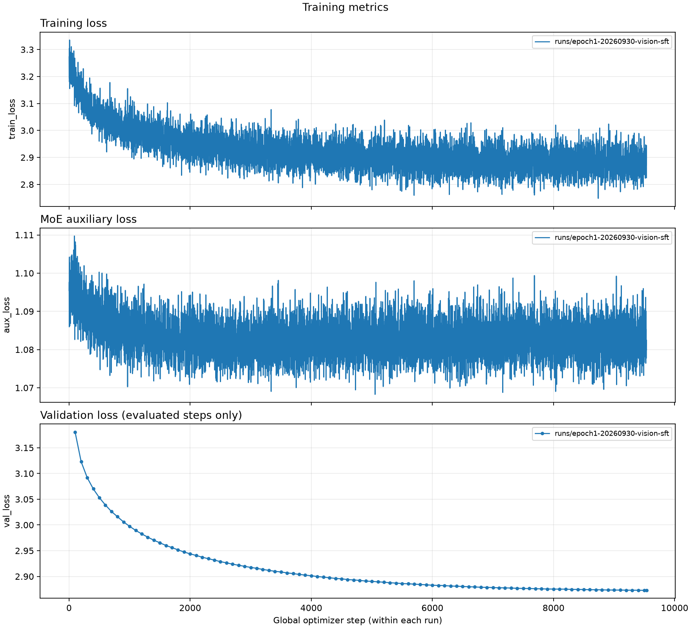

# MoE LLM Lab

**从零搭建 MoE 语言模型，贯通文本预训练、指令微调、视觉扩展与偏好及强化学习后训练。**

MoE LLM Lab 使用原生 PyTorch 实现核心网络和训练目标，以可阅读的代码组织完整的模型训练流程。项目包含自训练 BPE tokenizer、稀疏专家解码器、SigLIP 式图文编码器、视觉投影与 LoRA，以及 DPO、奖励模型、PPO 和 GRPO，可用于学习模型结构、复现训练阶段和开展对照实验。

[文本与视觉训练指南](docs/training-guide.md) · [后训练指南](docs/rl-training-guide.md) · [数据指南](docs/data-guide.md) · [设计文档](docs/design.md)

## 项目特性

- **语言模型**：RMSNorm、RoPE、GQA、SwiGLU、top-k 专家路由、负载均衡辅助损失与共享词嵌入；支持 Dense FFN 对照配置。
- **文本训练**：BPE 训练、JSONL 数据准备、预训练、全参数 SFT、生成与独立评测；SFT 仅监督 assistant 回答。
- **视觉扩展**：手写 SigLIP 式网络，支持加载兼容预训练权重或通过图文对训练；视觉对齐训练 projector，视觉 SFT 训练 projector 和 Q/V LoRA。
- **文本与图文双路径**：视觉适配阶段冻结语言基座；图像会话启用视觉 LoRA，纯文本会话关闭视觉 LoRA，使用原始文本路径。
- **偏好与策略学习**：实现 DPO、成对排序奖励模型、共享主干 value head 的 PPO，以及无 critic 的 GRPO；在线奖励支持可核验答案或冻结奖励模型。
- **实验管理**：单卡与多卡数据并行、混合精度、梯度累积、activation checkpointing、epoch/step 预算、断点恢复、进度条和结构化指标日志。
- **评测与可视化**：记录数据、配置与 checkpoint 指纹；支持验证最佳权重、文本保留检查，以及 loss、reward、KL 和训练诊断曲线绘制。

## 训练路线



DPO、PPO、GRPO 是从文本 SFT 出发的不同后训练路线，可以分别开展实验。视觉路线将冻结的图像编码器特征映射到语言模型输入空间，使用独立 adapter checkpoint 保存视觉适配参数。

## 模型架构与规模

| 配置 | 总参数 | 每 token 激活参数 | 用途 |
|---|---:|---:|---|
| `configs/moe-base.json` | 264,315,648 | 151,069,440 | 主模型配置 |
| `configs/moe-small.json` | 48,259,584 | 29,385,216 | 小规模对照 |
| `configs/moe-tiny.json` | 约 5 万 | 由 `inspect` 输出 | 快速流程测试 |

主模型采用 **16 层、768 hidden size、12 个 attention heads / 4 个 KV heads、4 个专家、top-2 路由、16K 词表和 2048 上下文长度**。每 token 激活参数统计包含完整 embedding 表。

视觉输入经编码器与投影层转换为图像 tokens，与文本 tokens 一起送入解码器。视觉适配默认采用 8×8 图像 token 网格与 Q/V LoRA；编码器、语言基座和 adapter 通过指纹绑定。

## 后训练方法

| 方法 | 数据与目标 | 验证指标 |
|---|---|---|
| DPO | 同一问题的 chosen/rejected；冻结 SFT reference，优化回答偏好 | 偏好 loss、偏好准确率 |
| Reward Model | 独立主干和标量 head，学习成对回答排序 | 排序 loss、偏好准确率 |
| PPO | 在线生成、任务奖励与 token KL 惩罚，GAE、policy/value clipping | 生成 reward、reference KL |
| GRPO | 每题生成多个回答，以组相对优势更新策略，加入 reference KL | 生成 reward、reference KL、零方差组比例 |

PPO/GRPO 区分问题集遍历的 `epochs` 和同一批 rollout 重复优化的 `update_epochs`。日志同时记录 prompt 曝光量、生成 tokens、rollout 数量和 optimizer 更新次数。

## 快速开始

使用 [uv](https://docs.astral.sh/uv/) 管理 Python 与依赖，项目版本由 `.python-version` 和 `uv.lock` 固定。在仓库根目录执行：

```bash
uv sync --locked
uv run --locked moe-lab doctor
uv run --locked moe-lab inspect --model-config configs/moe-base.json
uv run --locked pytest -q
```

按需启用视觉与绘图依赖：

```bash
uv sync --locked --extra vision --extra plot
```

使用微型模型与合成数据检查文本训练流程；输出目录应使用新名称：

```bash
uv run --locked python scripts/smoke.py --output runs/text-smoke-001
```

检查视觉或后训练流程：

```bash
uv run --locked --extra vision python scripts/smoke.py \
  --output runs/vision-smoke-001 --vision
uv run --locked python scripts/smoke.py \
  --output runs/posttrain-smoke-001 --posttrain
```

实际语料下载、tokenizer 训练、单卡短跑、多卡正式训练和 checkpoint 选择见[逐步训练指南](docs/training-guide.md)。MiniMind 偏好数据与 GSM8K 的固定版本下载、转换和评测准备见[后训练指南](docs/rl-training-guide.md)。

## 命令入口

`moe-lab` 是项目 CLI，使用 `uv run --locked moe-lab <command>` 调用；各命令支持 `--help`。

| 阶段 | 命令 |
|---|---|
| 环境与模型检查 | `doctor`、`inspect` |
| 文本数据与训练 | `tokenizer`、`prepare`、`train` |
| 文本推理与评测 | `generate`、`evaluate` |
| 视觉数据与适配 | `vision-prepare`、`vision-train` |
| 图文推理与评测 | `vision-generate`、`vision-evaluate` |
| 偏好与在线后训练 | `post-prepare`、`post-train`、`post-evaluate` |

SigLIP 图文预训练入口与权重导出方法见[训练指南](docs/training-guide.md)。文本、视觉适配、SigLIP 和后训练均支持 epoch 预算。文本/视觉训练采用 DDP，后训练采用显式梯度归约进行数据并行。

## 实验输出

每次训练使用独立 run 目录，保存配置、指标与恢复状态：

- `run.json`：训练配置、数据及 tokenizer 指纹、模型与运行环境信息。
- `metrics.jsonl`：各阶段训练/验证指标、学习率、梯度和计算开销。
- `step-*.pt`：模型或视觉 adapter、优化器、随机状态与数据进度。
- `summary.json`：末次训练及验证结果。
- `best.json`：使用验证 loss 的阶段中，记录最低 loss 对应的 checkpoint。
- `rollouts-rankXXX.jsonl`：PPO/GRPO 在线生成的回答、token IDs 和任务奖励。

`--init-from` 用于加载权重开启新阶段，`--resume` 用于恢复同一个实验的优化器和数据进度；恢复会核对配置与来源指纹。视觉生成需要对应的文本基座、编码器和 adapter。

## 训练曲线

下图展示文本与视觉训练阶段的训练 loss、MoE 辅助 loss 和验证 loss。

<details open>
<summary>文本预训练与指令微调</summary>





</details>

<details>
<summary>视觉对齐与视觉指令微调</summary>





</details>

绘制文本/视觉 loss：

```bash
uv run --locked --extra plot python scripts/plot_training.py \
  --runs runs/text-pretrain-001 --output reports/text-pretrain-loss.png \
  --smooth-window 50
```

绘制后训练 reward、KL 与诊断指标：

```bash
uv run --locked --extra plot python scripts/plot_posttraining.py \
  --runs runs/post-ppo-001 --output reports/post-ppo-metrics.png \
  --smooth-window 20
```

绘图只读取日志，支持多个 run 对比及 PNG/PDF/SVG 导出；验证指标保留实际评测点。

## 代码结构

```text
src/moe_llm/
├── model.py                 # MoE 解码器与专家路由
├── tokenizer.py / data.py   # BPE、文本切分与监督数据
├── training.py             # 文本预训练与 SFT
├── siglip*.py              # 图文编码器与对比训练
├── vision*.py / lora.py     # VLM、视觉适配与评测
├── posttrain*.py            # 偏好数据与后训练
├── rl_objectives.py         # DPO、PPO、GRPO 数学目标
└── cli.py                  # 命令行入口
configs/                    # 模型与训练配置
scripts/                    # 下载、转换、流程检查与绘图
fixtures/                   # 测试用合成数据
tests/                     # 网络、训练数学与恢复测试
docs/                      # 训练指南与设计文档
```

## 参考与致谢

项目参考了 [MiniMind](https://github.com/jingyaogong/minimind) 的小型语言模型训练实践，以及 [MiniMind-V](https://github.com/jingyaogong/minimind-v) 的视觉编码器与语言模型连接方式。感谢相关项目的开源工作。

后训练实现参考 [DPO](https://arxiv.org/abs/2305.18290)、[PPO](https://arxiv.org/abs/1707.06347) 与 [DeepSeekMath / GRPO](https://arxiv.org/abs/2402.03300)；视觉训练参考 [SigLIP](https://arxiv.org/abs/2303.15343) 的 sigmoid 图文匹配目标。数据与外部权重的来源、版本及许可证见对应指南。
